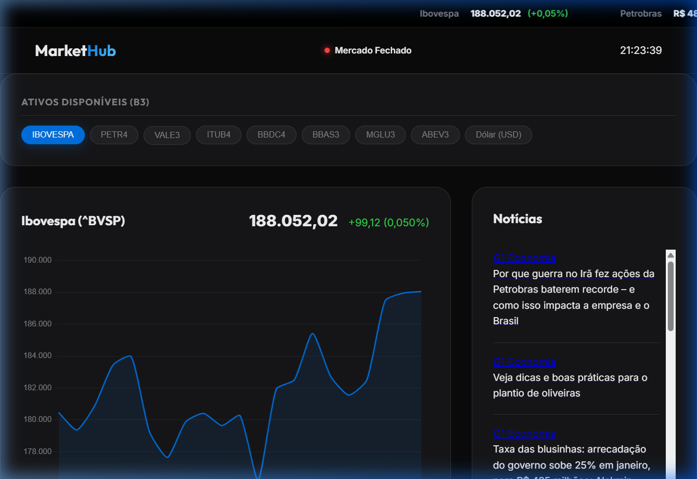

# MarketHub 💹 

[](https://cassio-gama.github.io/Market-Hub/)
[]()
[]()

MarketHub é um terminal financeiro de alta performance, projetado para oferecer uma experiência "Bloomberg-like" com foco em ativos da B3 (Brasil) e indicadores globais. O projeto utiliza uma arquitetura híbrida de **Static Frontend** alimentado por um **DataWorker em C#**.



---

## ✨ Funcionalidades Principais

- **🚀 Ticker-Tape Animado**: Letreiro contínuo no topo com cotações em tempo real e variações percentuais.
- **📊 Gráficos Interativos**: Visualização detalhada de ativos (IBOV, PETR4, VALE3, etc.) utilizando Chart.js com design Apple-style.
- **💵 Dólar Real-Time**: Integração com AwesomeAPI para cotação histórica e atual do par USD-BRL.
- **📰 Central de Notícias**: Feed automatizado do G1 Economia (via RSS) integrado diretamente ao dashboard.
- **🕒 Status de Mercado**: Indicador inteligente que detecta o horário de funcionamento da B3 (Brasília).
- **🛡️ Gestão de Cotas**: O DataWorker monitora o consumo de API para garantir operação dentro do limite gratuito (15.000 req/mês).

---

## 🛠️ Arquitetura e Stack

O projeto é dividido em dois componentes principais para máxima performance e custo zero:

### ⚙️ DataWorker (.NET 9.0)
Responsável por orquestrar a inteligência de dados em segundo plano:
- Busca cotações via Brapi API.
- Processa notícias financeiras via RSS.
- Gera o arquivo `data.json` que alimenta a interface.
- Gerencia o limite mensal de requisições.

### 🌐 Frontend (Vanilla Web)
Uma interface estática de alta performance:
- **HTML5/CSS3**: Design System baseado em *Glassmorphism* e Dark Mode.
- **JavaScript (ES6+)**: Consumo de dados via fetch, renderização de gráficos e cache de sessão.
- **Hospedagem**: Otimizado para GitHub Pages.

---

## 🚀 Como Executar Localmente

### 1. Pré-requisitos
- .NET SDK 9.0 instalado.
- Um servidor local simples (ex: Live Server do VS Code ou `npx serve`).

### 2. Sincronizar Dados
Entre na pasta do Worker e execute para gerar o `data.json`:
```powershell
cd MarketHub.Worker
dotnet run
```

### 3. Abrir o Dashboard
Basta abrir o arquivo `index.html` em seu navegador ou iniciar um servidor estático na raiz do projeto.

---

## 📦 Deploy no GitHub Pages

Este projeto foi desenhado para rodar perfeitamente no GitHub Pages. 
1. Suba os arquivos para um repositório no GitHub.
2. Ative o GitHub Pages nas configurações do repositório.
3. Use um **GitHub Action** (opcional) para rodar o Worker C# periodicamente e manter os dados vivos.

---

## 👤 Autor

Desenvolvido por **Cássio Gama** & **Antigravity AI**. 🚀📈💹

---
*Este é um projeto com fins educacionais e de visualização de dados financeiros. Utilize com responsabilidade.*
